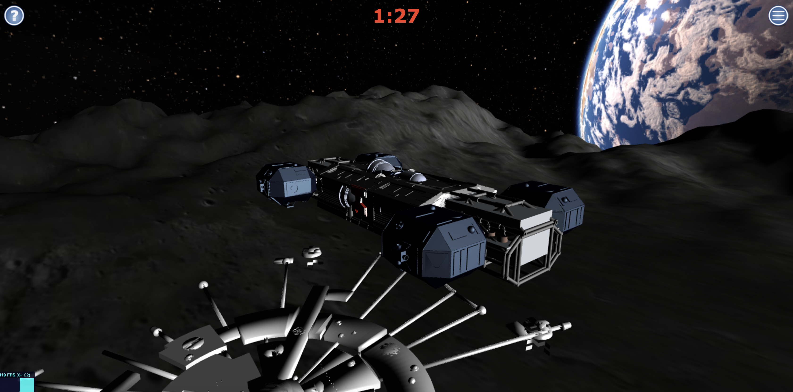

# Cosmos 2016: A 3D Lunar Lander Game

<p align="center">
	<a href="https://twitter.com/cz_antoine"></a>
	<a href="https://www.linkedin.com/in/antoine-cichowicz-837575b1"></a>
	<a href="https://github.com/czantoine/cosmos-2016"></a>
</p>

If you enjoy my projects and want to support my work, consider buying me a coffee! ☕️

[](https://ko-fi.com/V7V22V693)

---

# Cosmos 2016: A 3D Lunar Lander Game




**Cosmos 2016** is a 3D game inspired by the iconic science fiction series *Space: 1999*. This project was initially created when I was around 15-16 years old using **JavaScript**, **HTML5**, **CSS3**, **jQuery**, and 3D tools like **Blender**, **Three.js**, **Physi.js**, and **Ammo.js**. Although it’s an unfinished project, I believe it’s worth preserving and sharing on GitHub.

---

## 🎮 Game Concept

The game is a *Lunar Lander* simulation where players must land a spacecraft on the Moon's surface. The game world includes:  
- A **lunar scene** with a distant view of Earth.  
- A **Base Alpha**, inspired by the Moon base in *Space: 1999*.  
- Three types of spacecraft, including one **Eagle** model.  
- A **timer** to challenge players to land the spacecraft within a limited time.  

---

## 🧩 Features

- **Menu system**: Choose your spacecraft and initialize the game.  
- **3D environment**: A detailed lunar landscape created in Blender and rendered with Three.js.  
- **Physics-based gameplay**: Powered by Physi.js and Ammo.js for realistic movements.  

---

## 🚀 Backstory

In *Space: 1999*, nuclear waste stored on the Moon causes a massive explosion, sending the Moon and its inhabitants out of Earth's orbit and into deep space. The game is set in a similar alternate universe, where 311 survivors, led by Commander Koenig, navigate the challenges of space exploration.  

**Cosmos 2016** places you in the role of a pilot, tasked with safely landing a spacecraft on the Moon’s surface despite the challenges.  

---

## ⚙️ Tools and Technologies

- **Frontend**:  
  - HTML5, CSS3, JavaScript, jQuery  
- **3D Rendering**:  
  - Blender, Three.js  
- **Physics Engines**:  
  - Physi.js, Ammo.js  

---

## 🛠️ How to Run

### Using Docker [](https://github.com/czantoine/cosmos-2016/actions/workflows/docker.yml)

<p align="center">
  <a href="https://hub.docker.com/r/czantoine/cosmos-2016"></a>
  <a href="https://hub.docker.com/r/czantoine/cosmos-2016"></a>
</p>

1. Pull the prebuilt Docker image:  
   ```bash  
   docker pull czantoine/cosmos-2016  
   ```  

2. Run the Docker container:  
   ```bash  
   docker run -d -p 8080:80 czantoine/cosmos-2016  
   ```  

3. Access the game in your browser at:  
   ```
   http://localhost:8080  
   ```  

4. 🗂️ Incremental features or enhancements

	This project consists of multiple HTML files that simulate a space shuttle environment. Each file introduces incremental features or enhancements. Access these files by navigating to `http://localhost:8080/filename` (e.g., `http://localhost:8080/navette16.html`).
	
	### [**index.html**](workspace/index.html)
	- Complete scene setup with all advanced features, including shuttle controls, sound integration, difficulty levels, and game dynamics.  

 	---
	
	### [**navette.html**](workspace/navette.html)
	- Basic scene setup.  
	- Integration of the shuttle object (JSON format from Blender).  
	- Shuttle control using the `threex.keyboardstate.js` library.  
	
	---
	
	### [**navette1.html**](workspace/navette1.html)
	- Added sound integration when the shuttle moves.  
	
	---
	
	### [**navette2.html**](workspace/navette2.html)
	- Improved shuttle motion with velocity parameters to ensure smooth movement.  
	
	---
	
	### [**navette3.html**](workspace/navette3.html)
	- Fixed sound looping issues using start/stop conditions to prevent overlapping audio.  
	
	---
	
	### [**navette4.html**](workspace/navette4.html)
	- Added decor and Alpha base.  
	- Camera now follows the shuttle's position.  
	
	---
	
	### [**navette5.html**](workspace/navette5.html)
	- Additional controls for vertical (A/E) and horizontal movements (arrows).  
	- Responsive window resizing.  
	- Help (`info icon`) and menu (`menu icon`) modals added.  
	- Menu functionality: game launch and updates after starting the game.  
	
	---
	
	### [**navette7.html**](workspace/navette7.html)
	- Enhanced gameplay experience:  
  	- Preloading spinner before game launch.  
  	- Menu updates upon Game Over.  
	
	---
	
	### [**navette8.html**](workspace/navette8.html)
	- Difficulty levels introduced:  
  	- **Easy**: Standard speed and timer.  
  	- **Medium**: Faster shuttle, shorter timer.  
  	- **Hard**: High-speed shuttle, minimal timer.  
	- Gravity simulation adjustments integrated.  
	
	---
	
	### [**navette16.html**](workspace/navette16.html)
	- Consolidates previous features:  
  	- Full decor and Alpha base.  
  	- Camera tracking the shuttle.  
  	- Complete menu system with modal management.  
  	- Game launch updates to the menu.  
	
	---
	
	### [**navette20K.html**](workspace/navette20K.html)
	- Adds collision detection using bounding boxes between the Alpha base and the shuttle.  
	
	---
	
	### [**navette21.html**](workspace/navette21.html)
	- Complete set of features:  
  	- All previous integrations.  
  	- Enhanced preloading spinner for game loading and "New Game" menu option.  
  	- Countdown timer integrated into gameplay.  
  	- Menu updates for "Game Over."  
  	- Difficulty levels affect shuttle parameters and timers.  
  	- Gravity simulation enhancements.  
	
	---
	
	## **Physique Files**
	
	The `physique` files represent a progression of features similar to the `navette` files, focusing on physics-based enhancements and gameplay functionality.
	
	---
	
	### [**physique1.html**](workspace/physique1.html)
	- Scene initialization.  
	- Integration of the shuttle object (JSON format from Blender).  
	- Shuttle control using the `threex.keyboardstate.js` library.  
	
	---
	
	### [**physique2.html**](workspace/physique2.html)
	- Added sound integration when the shuttle moves.  
	
	---
	
	### [**physique3.html**](workspace/physique3.html)
	- Improved shuttle motion with velocity parameters to ensure smooth and non-jerky movement.  
	
	---
	
	### [**physique4.html**](workspace/physique4.html)
	- Fixed sound looping issues: introduced stop/start conditions for smoother sound playback without overlap or distortion.  
	
	---
	
	### [**physique5.html**](workspace/physique5.html)
	- Added decor and the Alpha base.  
	- Camera now follows the shuttle dynamically based on its position.  
	- Modified controls (A/E for up/down and arrows for lateral movements).  
	- Fully responsive window resizing.  
	- Help (`info icon`) and menu (`menu icon`) modal integration.  
	- Menu functionality: game launch and updates when the game starts.  
	
	---
	
	### [**physique6.html**](workspace/physique6.html)
	- Integrated a preloading spinner before game launch.  
	- Countdown timer added to the game.  
	- Menu updates based on game state (e.g., "Game Over").  
	
	---
	
	### [**physique7.html**](workspace/physique7.html)
	- Difficulty levels added:  
  	- **Easy**: Normal speed and timer.  
  	- **Medium**: Faster shuttle, shorter timer.  
  	- **Hard**: High-speed shuttle, minimal timer.  
	- Gravity simulation adjustments for added realism.
	
	---

## 📜 Unfinished Elements

While the game is functional in many ways, there are still areas for improvement:  
- **Collision detection**: Between the spacecraft and the lunar base.  
- **Refinement**: Menu UI and physics parameters.  

---

## 🌌 Acknowledgements

This project was inspired by the incredible imagination and storytelling of *Space: 1999*. Thanks to the creators of Three.js, Physi.js, Ammo.js, and Blender for providing the tools to bring this project to life.  

---

If you find this project useful, please give it a star ⭐️ ! Your support is greatly appreciated.
